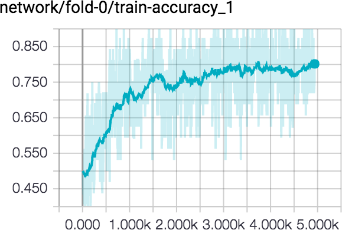
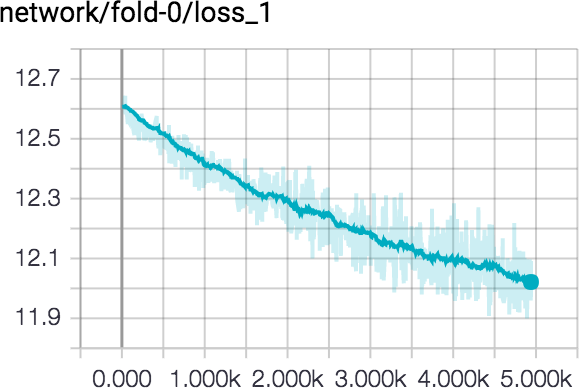
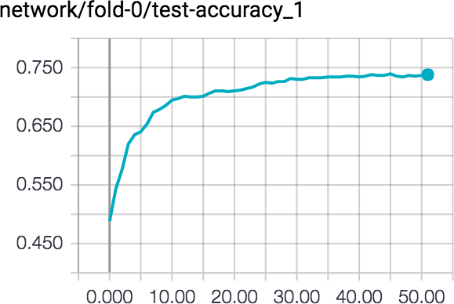

# Multilayer perceptron classifier in Tensorflow

MLP classifier implemented in Tensorflow for the [Kaggle competition: Are you sure Brighton's seagull is not a man-made object?](https://inclass.kaggle.com/c/are-you-sure-brighton-s-seagull-is-not-a-man-made-object/)

Features containing 4096 features extracted from fc7 of CaffeNet concatenated with 512 GIST features.

## How to use
run ```main.py``` which will automatically read the provided files from Kaggle, all located in folder ```data```:

* ```training.csv``` - Main data set containing features and labels. 
* ```testing.csv``` - Prediction data set which only contains features.
* ```additional_data.csv``` - Data set containing incomplete features with labels (only read if selected in flag, see under Parameters).


### Notes

To monitor progress, run TensorBoard in the same directory as ```main.py``` using: ```tensorboard --logdir=logs```
</br>
Progress can then be followed by opening this local host address in your browser.

Pressing ```ctrl+c``` will finish current epoch and save a prediction from current model.
Flags and parameter settings as well as predictions will be saved together with a model in directory ```logs/log_TIME```.


## Parameters
</br>
```main.py``` can be run with the following flags:


* ```folds``` - ```5``` - Number of folds.
* ```epochs``` - ```100``` - Number of epochs for each fold. 
* ```batch_size``` - ```32``` - Size of mini batches.
* ```learning_rate``` - ```0.00025``` - Set learning rate.
* ```l2_regulator``` - ```0.01``` - Regulates the L2 loss of the weights.
* ```optimizer``` - ```gradient``` - Choose which optimizer to use. [gradient, rmsprop, adam]
* ```drop_out``` - ```0.5``` - Sets the dropout in the fully connected layers.

* ```random_seed``` - ```1``` - Sets the seed.
* ```use_additional_data``` - ```True``` - Use additional, incomplete data provided from Kaggle.

Inside ```main.py``` the following parameter can be set:

* ```hiddens``` - ```[256,128,32]``` - Sets the number of layers and nodes in each layer, with ReLU as activation function.


## Results
</br>
Example run over 50 epochs can be seen below with a end result of 72%, and parameters:

```hiddens: [1000,500,32]```, ```batch_size: 32```, ```learning_rate: 0.00025```, ```l2_regulator: 0.01```, ```drop_out: 0.5```

   


Best results gave a 76.1% score, which was top 20.